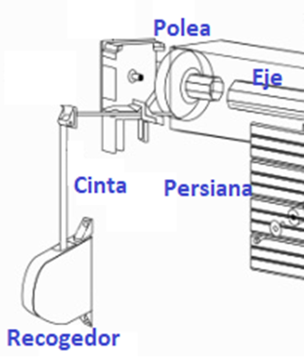
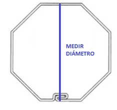

# PERSIANA_DOMOTIZADA_ARDUINO

Proyecto basado en Arduino, para poder accionar una persiana con un motor en su interior. Dicho motor podrá ser accionado mediante dos botones o bien mediante un sensor de luz, el cual hará una comparativa con la luz del exterior.

## VENTAJAS:
Permite tener el control de la luz que entra a la vivienda.
Protección solar al evitar la entrada de rayos de sol.

## ELECCIÓN DEL MOTOR ADECUADO:
### 1. Tipo de accionamiento:

1- Vía radio: accionado por un mando.
2- Vía cable: accionado por pulsadores.

Ambos casos pueden ser accionados por WiFi.

### 2.Diámetro del eje:
El motor tiene que encajar a la perfección en tu eje.
Probablemente sea de 40mm o 60mm.

### 3.Peso de tu persiana.
Para calcular el peso de tu persiana, puedes utilizar la siguiente fórmula:
**Alto** x **Largo** x **Peso del Material** = **Kg** de la persiana.

| MATERIAL | PESO  |
|----------|-------|
| Al       |  5    |
| Al Ex    |  15   |
| PVC      |  7    |
| Madera   |  15   |

(Al Ex = aluminio extrusionado)

CC BY-NC-SA 3.0 ES Alejandro Pérez

